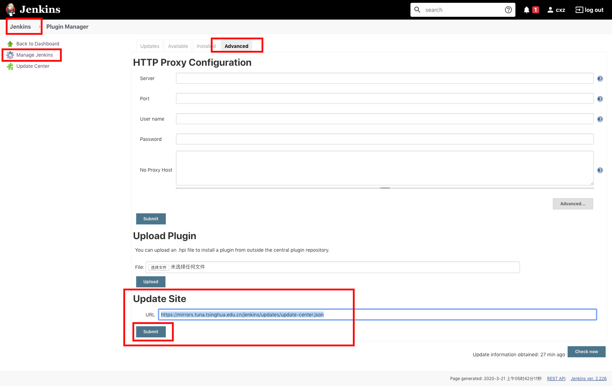
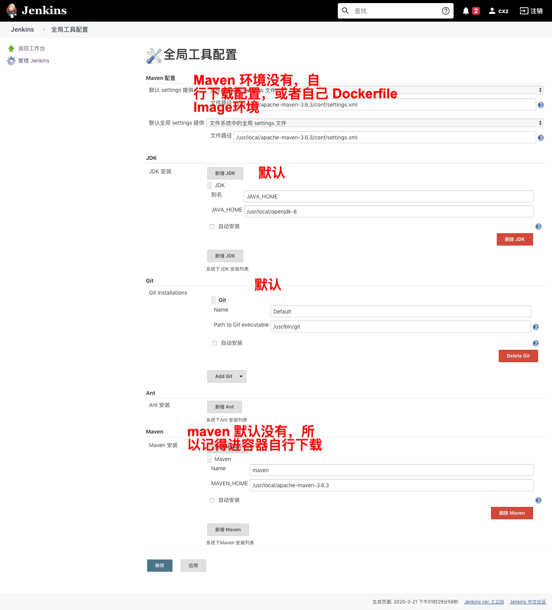
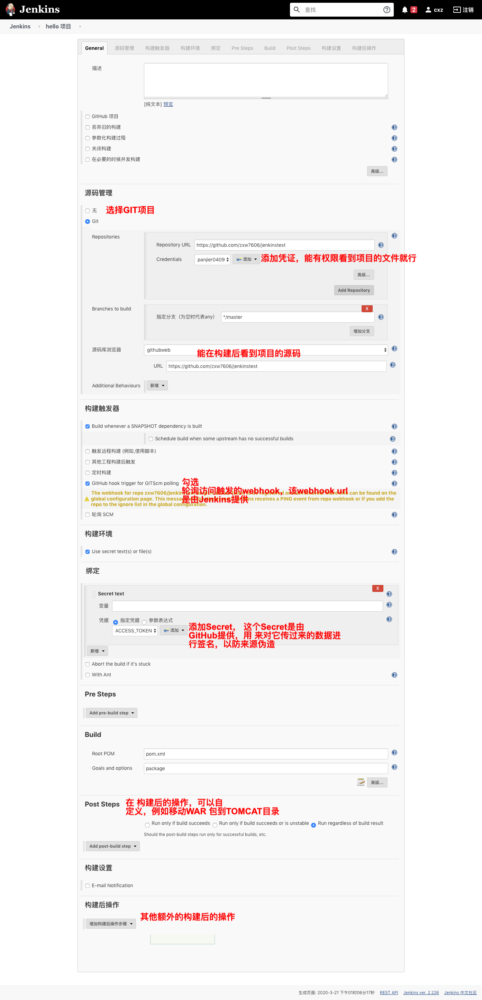
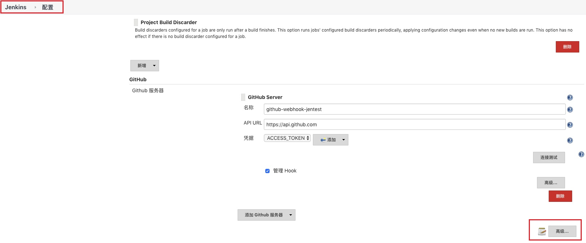
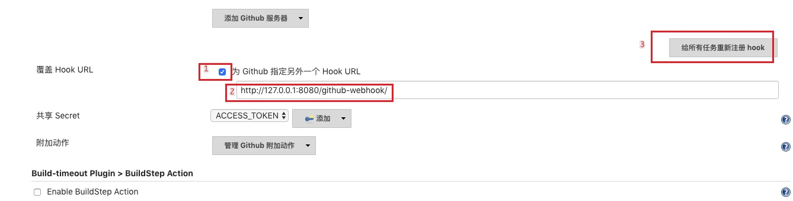
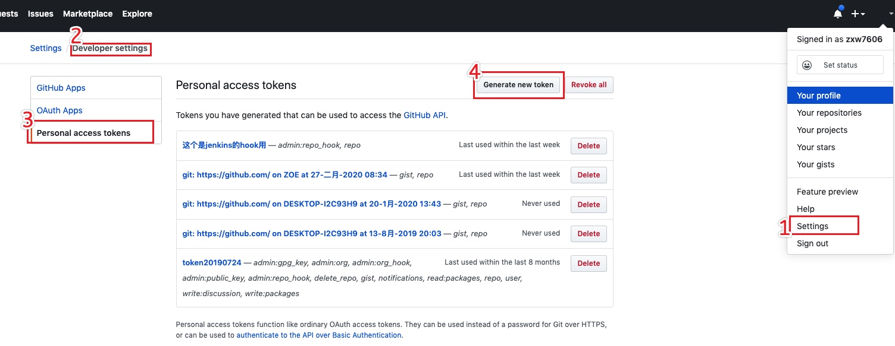
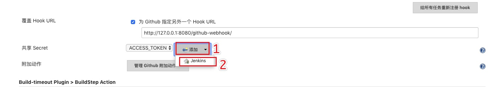

### 安装环境

| 环境 | 名称   |
| :--- | :----- |
| 容器 | docker |

### 步骤
<!-- more -->
1. `sudo docker pull jenkins/jenkins`
2. `sudo docker run -d -p 8080:8080 -p 50000:50000 -v ~/jenkins:/var/jenkins_home jenkins/jenkins`
3. `cat jenkins/secrets/initialAdminPassword`,复制和登陆
4. 跳过插件的安装
5. 配置国内源`https://mirrors.tuna.tsinghua.edu.cn/jenkins/updates/update-center.json`

6. `sudo docker restart [你的jenkins容器id/name]`,重启
7. 插件选择
   1. `Localization: Chinese (Simplified)`,中文环境
   2. `	Maven Integration`,创建Maven任务
   3. `	Git`,用于git的插件「用来获取项目」

8. 配置全局的环境

9.  创建任务

10. 写代码提交

### 说明
- webhook的URL配置

点开之后

- Secret配置

**配置的地方（2个方式）**
1. 直接在创建任务的时候选择`Secret Text`粘贴进去就行

2. 

### 总结

**潜在的问题**
1. Jenkins在GitHub上提供webhook-url的时候，因为Jenkins在本地的内网环境无法被访问，所以在此配置了内网穿透（即外网能访问内网的工具，前提是有一个公网机器来充当中介）
2. 镜像的环境不太完全，首先没有Maven，**其次插件在配置国内源之后依旧很慢**。解决的方法只有从[jenkins/jenkins](https://github.com/jenkinsci/docker)多参考