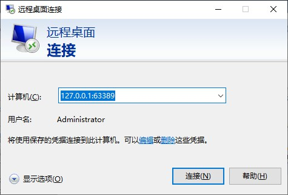

**使用情景**：

在家中想要访问公司的电脑，但是公司的电脑处于内网中，不能直接通过ip地址访问， 如果需要ssh公司电脑或者说远程控制公司电脑，又不需要钱以及TeamViewer之类的工具，因为这些工具不能商用，使用次数会有限制，另外其他的远程软件比如向日葵，QQ比较卡顿，十分嫌弃。


**使用方法**

<!-- more -->

使用前提：一个有公网IP的服务器，比如腾讯云，阿里云之类的


步骤1. 下载 <a href='https://github.com/fatedier/frp/releases' >**FRP**</a> `注i386 是32位的，arm64 是64位的`

步骤2. 将FRP分别解压到**服务器** 和 **公司电脑** 和 **你家里的电脑**  


步骤3. 配置服务器上的FRP：

```ini
# 服务器上的 frps.ini
[common]
bind_udp_port = 7001
```

紧接着 启动服务器 任选一

```bash
# 1.前台执行
./frps -c ./frps.ini
# 2.后台执行 
nohup ./frps -c ./frps.ini 2>&1 > ./aa.log &
```

启动成功输出状态:

```shell
2020/02/26 20:05:17 [I] [service.go:152] frps tcp listen on 0.0.0.0:7000
2020/02/26 20:05:17 [I] [service.go:233] nat hole udp service listen on 0.0.0.0:7001
2020/02/26 20:05:17 [I] [root.go:205] start frps success
```


步骤4. 配置公司电脑上的FRP


```ini
# 公司电脑 frpc.ini
[common]
server_addr = 服务器IP
server_port = 7000

[p2p_mstsc] # 任意
# 选择stcp协议 
type = stcp   

#该字段随意，不过要和下面的一致
sk = abcdefg  

# 本地地址
local_ip = 127.0.0.1 
# 本地的mstsc端口
local_port = 3389 

```

启动 

```bash
frpc.exe -c ./frpc.ini
```

启动成功

```bash
D:\download\frp_0.31.2_windows_amd64\frp_0.31.2_windows_amd64>frpc.exe -c ./frpc.ini
2020/02/26 20:05:21 [I] [service.go:250] [dfa5ce1ef655b493] login to server success, get run id [dfa5ce1ef655b493], server udp port [7001]
2020/02/26 20:05:21 [I] [proxy_manager.go:144] [dfa5ce1ef655b493] proxy added: [secret_tcp]
2020/02/26 20:05:21 [I] [control.go:164] [dfa5ce1ef655b493] [secret_tcp] start proxy success
```


步骤5. 配置家里的FRP:


```ini
# 家里电脑 frpc.ini
[common]
server_addr = 服务器IP
server_port = 7000

[p2p_mstsc_visitor]

# 和上方一致
type = stcp

# 和上方一致
sk=abcdefg
role=visitor
server_name=p2p_mstsc
bind_addr = 127.0.0.1
bind_port = 63389

```

启动

```bash
frpc.exe -c ./frpc.ini
```


步骤6. 家里的电脑连接即可



