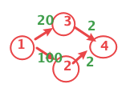

## 算法目的

求出各顶点到各顶点的最短路径(不是路径全部加起来最小)





矩阵格式

```csv
         0,        80,        30,     32767,
        20,         0,     32767,     32767,
     32767,        40,         0,        45,
        10,     32767,     32767,         0,

```

## 算法步骤

刚开始没有中间节点

依次加入，更新各个点到各个点的距离，例如 i->k ->j 的距离小于 i->j 的距离那么更新dist[i][j]为dist(i->k->j)，同时也标记从i到j的路径最近，但是点是最开始的中间节点即 i->k（可能i和k中间还有很多的中间节点所以path[i]\[j] = path[i]\[k]，而不是path[i]\[j]=k，因为path[i]\[k] 在每次添加中间节点m之后也会更新，path[i\][k\]=path[i\][m\]。

例如:



<!--more-->

path\[1]\[4] = path\[1]\[2]=2

之后 

path\[1]\[4] = path\[1]\[3]=3

```c++
#include <iostream>
#include <iomanip> //不要忘记包含此头文件
#include "AdjMatrix.cpp"
using namespace std;
void floyd(AdjMatrix &G)
{
    // int **dist = new int[G.numV][G.numV]{SHRT_MAX}; // 到 i 点的最短距离

    int dist[G.numV][G.numV];
    int path[G.numV][G.numV]; // i 点存放 该顶点的前一个顶点
    // int *s = new int[G.numV]{0};

    // 初始化
    for (int i = 0; i < G.numV; i++)
    {
        for (int j = 0; j < G.numV; j++)
        {
            dist[i][j] = G.eage[i][j];

            if (i != j && dist[i][j] < SHRT_MAX)
            {
                path[i][j] = j;
            }
            else
            {
                path[i][j] = -1;
            }
        }
    }
  
    // k添加的节点, i form节点 ,j to节点
    for (int k = 0; k < G.numV; k++)
    {
        for (int i = 0; i < G.numV; i++)
        {
            for (int j = 0; j < G.numV; j++)
            {
                if (i != j && dist[i][k] + dist[k][j] < dist[i][j])
                {
                    dist[i][j] = dist[i][k] + dist[k][j];
                    // 记录 i =》 j 的最后一个最近的中间节点
                    path[i][j] = path[i][k];
                }
            }
        }
    }

    for (int i = 0; i < G.numV; i++)
    {
        for (int j = 0; j < G.numV; j++)
        {
            cout << path[i][j] << ",";
        }
        cout << endl;
    }

    for (int i = 0; i < G.numV; i++)
    {
        for (int j = 0; j < G.numV; j++)
        {
            int mid = path[i][j];
            // min s from i to j
              if (mid==-1)
            {
                continue;
            }
            cout << i << "=>";
            while (mid != -1 && mid != j)
            {
                cout << mid << "=>";
                mid = path[mid][j];
            }
            cout << j << endl;
        }
    }
}

int main()
{
    AdjMatrix adjMatrix(4);
    adjMatrix.inputE(6);
    adjMatrix.print();
    floyd(adjMatrix);

    return 0;
}
/* output

0=>2=>1
0=>2
0=>2=>3
1=>0
1=>0=>2
1=>0=>2=>3
2=>3=>0
2=>1
2=>3
3=>0
3=>0=>2=>1
3=>0=>2
*/
```

