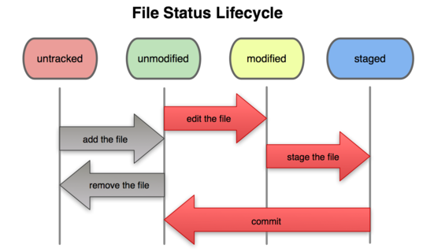
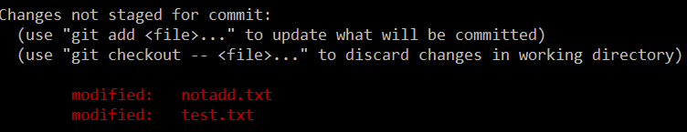
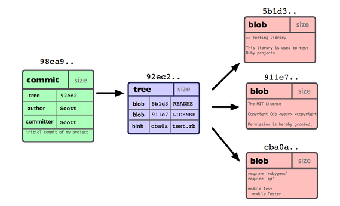

在保存到 Git **之前**，所有数据都要进行内容的校验和（checksum）计算，并将此结果作为数据的唯一标识和索引。换句话说，不可能在你修改了文件或目录之后，Git 一无所知。这项特性作为 Git 的设计哲学，建在整体架构的最底层。所以如果文件在传输时变得不完整，或者磁盘损坏导致文件数据缺失，Git 都能立即察觉。

Git 使用 SHA-1 算法计算数据的校验和，通过对文件的内容或目录的结构计算出一个 SHA-1 哈希值，作为指纹字符串。该字串由 40 个十六进制字符（0-9 及 a-f）组成，看起来就像是：

```
24b9da6552252987aa493b52f8696cd6d3b00373
```

**Git 的工作完全依赖于这类指纹字串，所以你会经常看到这样的哈希值。实际上，所有保存在 Git 数据库中的东西都是用此哈希值来作索引的，而不是靠文件名。**


<!-- more -->





编辑一个文件



```bash
Untracked files:  #提示新建的文件处于untracked
Changes not staged for commit:  #提示改变的文件没有提交（注：这个文件是之前commit过的 并且修改之后没有ADD）
```


**查看不同**

```shell
git diff # 比较当前工作目录和暂存之间的不同
```

```shell
git diff --staged # 比较暂存和已提交的不同
```


```shell
git commit 加上 -a 选项，Git 就会自动把所有已经跟踪过的文件暂存起来一并提交，从而跳过 git add 步骤：
```


```shell
git rm readme.txt # 一旦提交那么文件会从硬盘中删除
git rm --cached readme.txt #保留到工作目录
```


```shell
git commit --amend  # 修改提交内容
```


**回退版本**

```shell
git reset HEAD notadd.txt # 撤销HEAD分支

git reset --hard HEAD^ # 暂存区和Staged区的内容全部消失
git reset --soft HEAD^ # 工作目录->暂存区  HEAD回退到节点  相当于 工作目录和当前节点相比
```


```shell
git fetch [remote-name] # 此命令会到远程仓库中拉取所有你本地仓库中还没有的数据

# 和pull的区别
# 1.相当于是从远程获取最新版本到本地，不会自动merge 文件可能被覆盖
```


```bash
git push [remote-name] [branch-name]
```


```shell
git show tag 显示当前节点的信息
```


**在 Git 中提交时，会保存一个提交（commit）对象，该对象包含一个指向暂存内容快照的指针**


当使用 `git commit` 新建一个提交对象前，Git 会先计算每一个**子目录**（本例中就是项目根目录）的校验和，然后在 Git 仓库中将这些目录保存为树（tree）对象。**之后 Git 创建的提交对象，除了包含相关提交信息以外，还包含着指向这个树对象（项目根目录）的指针**，如此它就可以在将来需要的时候，重现此次快照的内容了。





### 创建分支

```shell
$ git branch testing  # 创建分支
```

```shell
$ git checkout testing # 切换分支
```


待续..

[参考链接](http://iissnan.com/progit/html/zh/ch3_3.html)