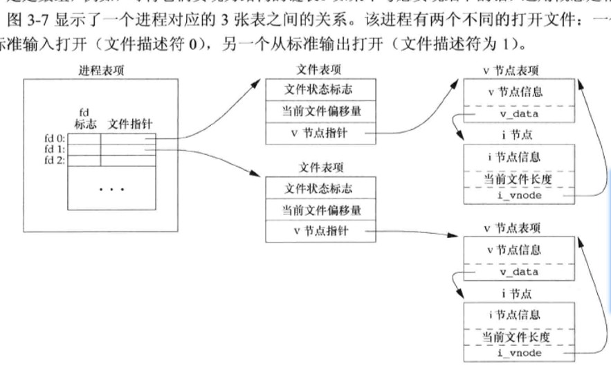
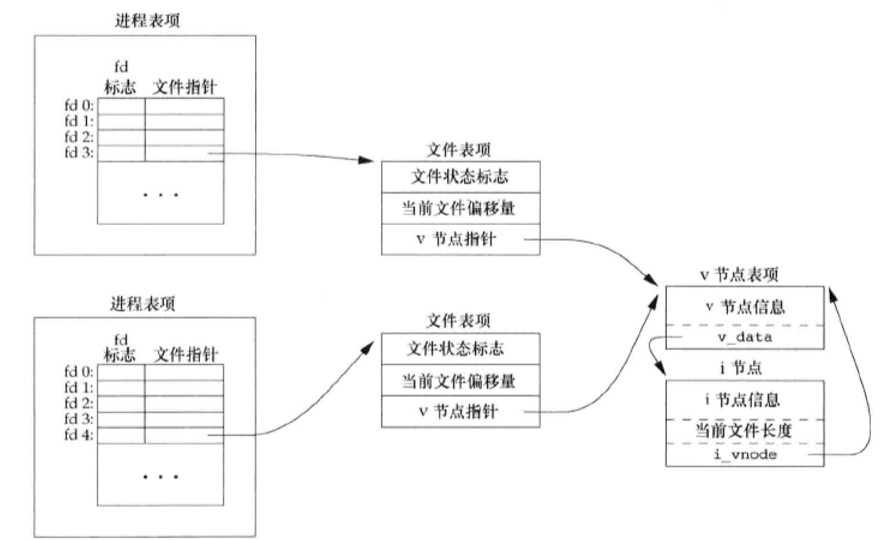

## 读取文件

进程读取文件的模型如下图


## 文件描述符与文件的对应关系

每一个进程默认有3个描述符0,1,2 分别代表`标准输入`，`标准输出`，`错误输出`，列在进程内存中的`进程表项`中，每个描述符对应一个`文件表项`的指针
`文件表项`由内核管理中，`文件表项中`，包含了文件的状态标志，比如可读写或者其他，还有文件偏移量，进程写入文件时，偏移量会增大相应的数据字节数量
`v节点指针`指向v节点，包含了操作文件的函数指针
`i节点`是文件的索引信息，包括文件了在磁盘的位置等详细信息

<!-- more -->




## 将一个文件描述符转化为标准输出描述符代码实验

```c
#include <unistd.h>
#include <fcntl.h>
#include <apue.h>
#define BUFFSIZE 4096
int main(int argc, char const *argv[])
{
    int fd, n;
    char buf[BUFFSIZE];
    // 读取文件
    if (!(fd = open("tty_stdout.txt",O_RDWR|O_CREAT,0644)))
        err_sys("cant open tty_stdout.txt");
    // 复制文件描述符到标准输出描述符
    if(!dup2(fd,STDOUT_FILENO))
        err_sys("cant copy 文件表");
    // wirte...
    while ((n=read(STDIN_FILENO,buf,BUFFSIZE))>0)
    {
         if (buf[strlen(buf) - 1] == '\n')
             buf[strlen(buf) - 1] = 0;

         if (write(STDOUT_FILENO, buf, n)!=n)
         err_sys("write error!\n");
    }
    return 0;
}
```
`结果文件`
```txt
nihaoa
```

## 总结

可见，每个进程都会默认开启3个文件
当多个进程同时打开一个文件时，因为文件表不是共享的，因此偏移量为每个进程所有，多个进程同时对文件写时会造成数据错误，但并不是不能同时向一个文件写入。

例外像我们的终端tty 会默认开启/dev/ttyXXX文件为标准输出