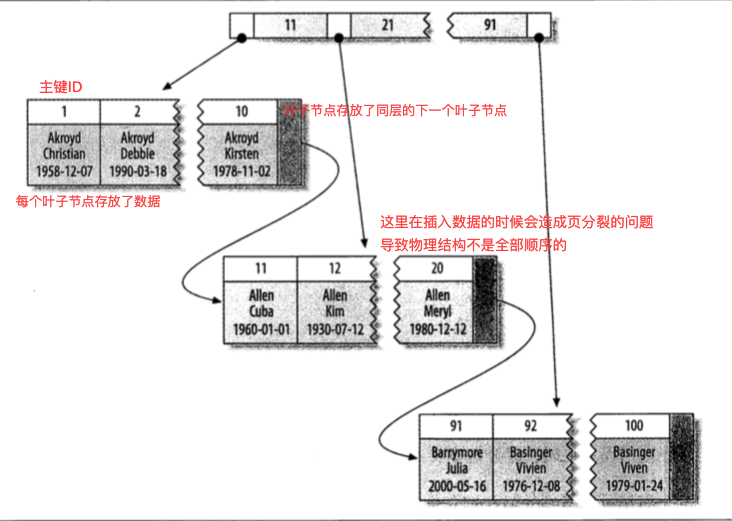
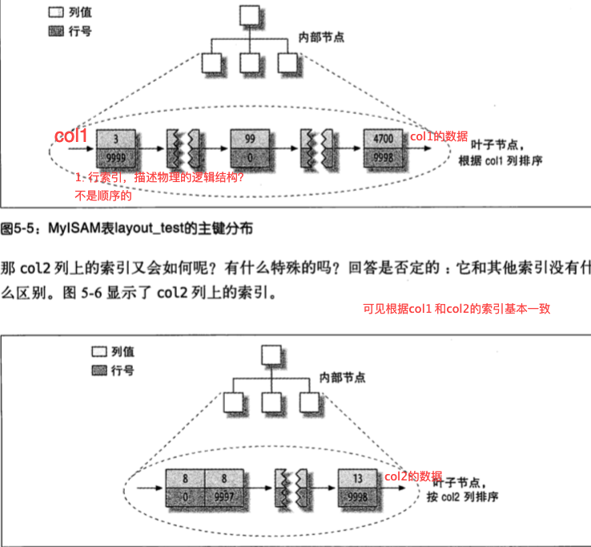
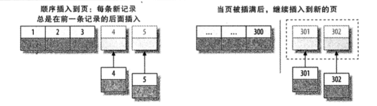
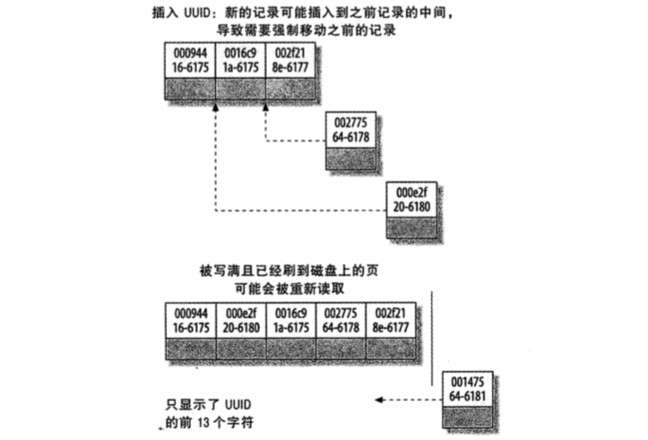

## 索引的作用

配置索引类型来修改底层数据存储的顺序结构

避免全盘扫描，减少磁盘I/O

<!--more-->

## 索引类型

- BTree

B-Tree 或者 B+Tree 等

[^策略]: 从最左列开始排序，可以将选择性最高的列放在前面


- 哈希索引

对索引列计算哈希码

哈希表中存放数据行的指针

例

```sql
CREATE TABLE testhash{
	fname varchar(22)
  KEY USING HASH(fname)
}
```

- RTree

- 全文索引

## 索引策略

使用不当

例如：

```sql
#xxx 索引无法生效
select * from x where xxx + 1 = 5

```

### 前缀索引

```sql
create table x {
	KEY USING xx(7)
}
```

### 多列索引

索引合并策略

```sql
# 关键字查看SQL操作的方式
EXPLAIN SElECT ...
```

### 聚簇索引





**MyISAM 索引结构对比**




#### 小节

索引的选择 尽量避免索引的范围分布大 并且不随机

例如 innodb默认主键是一个索引, 我们一般选择自增主键 和 uuid主键

但是自增主键如图



此方式保持了数据的连续性，符合底层数据物理内存的读写连贯性


UUID如图



### 覆盖索引

> 如果一个索引包含（或者说覆盖）所有需要查询的字段的值，我们称之为覆盖索引


### 重复索引

1. 例如

```sql
CREATE TABLE test{
	ID NOT NULL PRIMARY KEY
	...
	
	# 重复索引
	UNIQUE(ID)
	INDEX(ID)
}
```

此时ID 共有3个重复索引（包括主键自带的索引）<u>*如果没有不同的查询需求不需要创建重复索引*</u>

2. 

（A，B）索引可以来当（A）索引使用（适用于B-Tree，符合前缀索引）