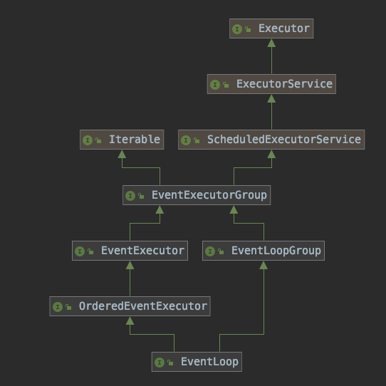
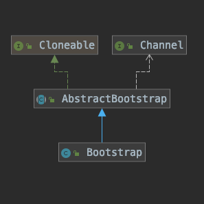
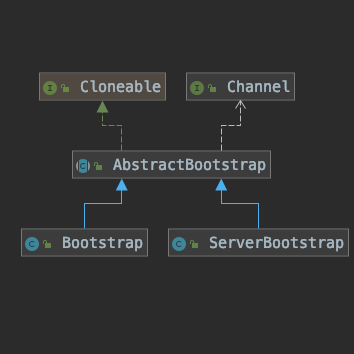
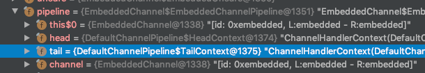
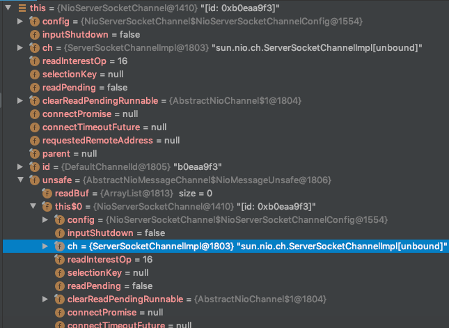

# Netty 


## EchoServer代码示例
```java
/**
 * Echoes back any received data from a client.
 */
public final class EchoServer {

    static final boolean SSL = System.getProperty("ssl") != null;
    static final int PORT = Integer.parseInt(System.getProperty("port", "8007"));

    public static void main(String[] args) throws Exception {
        // Configure SSL.
        final SslContext sslCtx;
        if (SSL) {
            SelfSignedCertificate ssc = new SelfSignedCertificate();
            sslCtx = SslContextBuilder.forServer(ssc.certificate(), ssc.privateKey()).build();
        } else {
            sslCtx = null;
        }

        // Configure the server.
        EventLoopGroup bossGroup = new NioEventLoopGroup(1);
        EventLoopGroup workerGroup = new NioEventLoopGroup();
        final EchoServerHandler serverHandler = new EchoServerHandler();
        try {
            ServerBootstrap b = new ServerBootstrap();
            b.group(bossGroup, workerGroup)
             .channel(NioServerSocketChannel.class)
             .option(ChannelOption.SO_BACKLOG, 100)
             .handler(new LoggingHandler(LogLevel.INFO))
             .childHandler(new ChannelInitializer<SocketChannel>() {
                 @Override
                 public void initChannel(SocketChannel ch) throws Exception {
                     ChannelPipeline p = ch.pipeline();
                     if (sslCtx != null) {
                         p.addLast(sslCtx.newHandler(ch.alloc()));
                     }
                     //p.addLast(new LoggingHandler(LogLevel.INFO));
                     p.addLast(serverHandler);
                 }
             });

            // Start the server.
            ChannelFuture f = b.bind(PORT).sync();

            // Wait until the server socket is closed.
            f.channel().closeFuture().sync();
        } finally {
            // Shut down all event loops to terminate all threads.
            bossGroup.shutdownGracefully();
            workerGroup.shutdownGracefully();
        }
    }
}
```

<!--more-->

## 组件描述

- ChannelHandler

Handles an I/O event or intercepts an I/O operation, and forwards it to its next handler in
its ChannelPipeline

```java
public interface ChannelHandler {

    /**
     * 当把 ChannelHandler 添加到 ChannelPipeline 中时被调用
     */
    void handlerAdded(ChannelHandlerContext ctx) throws Exception;
    void handlerRemoved(ChannelHandlerContext ctx) throws Exception;
    @Deprecated
    void exceptionCaught(ChannelHandlerContext ctx, Throwable cause) throws Exception;
    /**
		 代表当前对象添加到多个ChannelPipelines但不会产生竞争条件
     */
    @interface Sharable {
        // no value
    }
}

```
- ChannelPipeline

可以看出ChannelPipeline管理着Handler的链式调用 也是Handler的容器

```java
                                               I/O Request
                                          via Channel or
                                      ChannelHandlerContext
                                                    |
+---------------------------------------------------+---------------+
|                           ChannelPipeline         |               |
|                                                  \|/              |
|    +---------------------+            +-----------+----------+    |
|    | Inbound Handler  N  |            | Outbound Handler  1  |    |
|    +----------+----------+            +-----------+----------+    |
|              /|\                                  |               |
|               |                                  \|/              |
|    +----------+----------+            +-----------+----------+    |
|    | Inbound Handler N-1 |            | Outbound Handler  2  |    |
|    +----------+----------+            +-----------+----------+    |
|              /|\                                  .               |
|               .                                   .               |
| ChannelHandlerContext.fireIN_EVT() ChannelHandlerContext.OUT_EVT()|
|        [ method call]                       [method call]         |
|               .                                   .               |
|               .                                  \|/              |
|    +----------+----------+            +-----------+----------+    |
|    | Inbound Handler  2  |            | Outbound Handler M-1 |    |
|    +----------+----------+            +-----------+----------+    |
|              /|\                                  |               |
|               |                                  \|/              |
|    +----------+----------+            +-----------+----------+    |
|    | Inbound Handler  1  |            | Outbound Handler  M  |    |
|    +----------+----------+            +-----------+----------+    |
|              /|\                                  |               |
+---------------+-----------------------------------+---------------+
                |                                  \|/
+---------------+-----------------------------------+---------------+
|               |                                   |               |
|       [ Socket.read() ]                    [ Socket.write() ]     |
|                                                                   |
|  Netty Internal I/O Threads (Transport Implementation)            |
+-------------------------------------------------------------------+
```


- ChannelHandlerContext

每一个Handler都分配一个Context 用来在 Pile中交互和 Handler链式调用方法的中间载体

hanlder 调用 下一个 context 然后 ,context 调用  他的handler , handler 继续调用 下一个 context

**handler事件默认的回调方法**


- ChannelFuture

交给Netty 执行回调函数

```java
                                        +---------------------------+
                                        | Completed successfully    |
                                        +---------------------------+
                                   +---->      isDone() = true      |
   +--------------------------+    |    |   isSuccess() = true      |
   |        Uncompleted       |    |    +===========================+
   +--------------------------+    |    | Completed with failure    |
   |      isDone() = false    |    |    +---------------------------+
   |   isSuccess() = false    |----+---->      isDone() = true      |
   | isCancelled() = false    |    |    |       cause() = non-null  |
   |       cause() = null     |    |    +===========================+
   +--------------------------+    |    | Completed by cancellation |
                                   |    +---------------------------+
                                   +---->      isDone() = true      |
                                        | isCancelled() = true      |
                                        +---------------------------+
```

```java
public interface ChannelFuture extends Future<Void> {

    /**
     * Returns a channel where the I/O operation associated with this
     * future takes place.
     */
    Channel channel();

    @Override
    ChannelFuture addListener(GenericFutureListener<? extends Future<? super Void>> listener);

    @Override
    ChannelFuture addListeners(GenericFutureListener<? extends Future<? super Void>>... listeners);

    @Override
    ChannelFuture removeListener(GenericFutureListener<? extends Future<? super Void>> listener);

    @Override
    ChannelFuture removeListeners(GenericFutureListener<? extends Future<? super Void>>... listeners);

    @Override
    ChannelFuture sync() throws InterruptedException;

    @Override
    ChannelFuture syncUninterruptibly();

    @Override
    ChannelFuture await() throws InterruptedException;

    @Override
    ChannelFuture awaitUninterruptibly();
    boolean isVoid();
}
```

- EventLoop

目前了解的结构如下

每一个EventLoopGroup处理种类型的事件 

```java-
+ - - - - - - - - - - - - - - - - - - - - - - - - - - - - - - - - - - - - - - - - +
                                                                                   
|                                                                                 |
         +----------------------------------------------------------------+        
|        |                         EventLoopGroup                         |       |
         |         +---------+      +---------+       +---------+         |        
|        |         |EventLoop|      |EventLoop|       |EventLoop|         |       |
         |         +---------+      +---------+       +---------+         |        
|        +-------------------------------^--------------------------------+       |
                                         |                                         
|                                        |                                        |
                                         |                                         
|                                        |                                        |
           +-------------+               |                                         
|          |   Channel   |               |                                        |
           |             |-------register+                                         
|          +-------------+                                                        |
                                                                                   
|                                                                                 |
                                                                                   
+ - - - - - - - - - - - - - - - - - - - - - - - - - - - - - - - - - - - - - - - - +
```


- ChannelInitializer

本身也是个Handler

```java
@SuppressWarnings("unchecked")
private boolean initChannel(ChannelHandlerContext ctx) throws Exception {
    if (initMap.add(ctx)) { // Guard against re-entrance.
        try {
          	// 初始化自定义的方法 通过ChannelHandlerContext
            initChannel((C) ctx.channel());
        } catch (Throwable cause) {
            // Explicitly call exceptionCaught(...) as we removed the handler before calling initChannel(...).
            // We do so to prevent multiple calls to initChannel(...).
            exceptionCaught(ctx, cause);
        } finally {
            ChannelPipeline pipeline = ctx.pipeline();
          	// 移除自己的Context
            if (pipeline.context(this) != null) {
                pipeline.remove(this);
            }
        }
        return true;
    }
    return false;
}
```


移除自己方法如下

```java
private synchronized void atomicRemoveFromHandlerList(AbstractChannelHandlerContext ctx) {
    AbstractChannelHandlerContext prev = ctx.prev;
    AbstractChannelHandlerContext next = ctx.next;
    prev.next = next;
    next.prev = prev;
}
```

可见Context是一个双链表

## 小节

如果EventLoop对应一个线程对应一个Channel ,那么Group是一个线程池

每个Channel有消息那么交给他的Loop 然后让线程处理消息。


## ByteBuf

### 初步浏览

**类的结构**

```java
public abstract class ByteBuf implements ReferenceCounted, Comparable<ByteBuf> {}
```

实现了ReferenceCounted ,可能和JVM有关 ，顾名思义，引用计数法

实现了Comparable，可能和内存有关，调整数据在内存的存储顺序

```java
    +-------------------+------------------+------------------+
    | discardable bytes |  readable bytes  |  writable bytes  |
    |                   |     (CONTENT)    |                  |
    +-------------------+------------------+------------------+
    |                   |                  |                  |
    0      <=      readerIndex   <=   writerIndex    <=    capacity
```
可见有两个指针 读数据在两个指针之间 写数据在w与最后


[^discardable]:adj.	可废弃的


```java
    BEFORE discardReadBytes()
  
        +-------------------+------------------+------------------+
        | discardable bytes |  readable bytes  |  writable bytes  |
        +-------------------+------------------+------------------+
        |                   |                  |                  |
        0      <=      readerIndex   <=   writerIndex    <=    capacity
  
  
    AFTER discardReadBytes()
  
        +------------------+--------------------------------------+
        |  readable bytes  |    writable bytes (got more space)   |
        +------------------+--------------------------------------+
        |                  |                                      |
   readerIndex (0) <= writerIndex (decreased)        <=        capacity
```

可以看出 discardReadBytes 的空间是用来给写字节扩容的


### 清除方法

```java
    BEFORE clear()
  
        +-------------------+------------------+------------------+
        | discardable bytes |  readable bytes  |  writable bytes  |
        +-------------------+------------------+------------------+
        |                   |                  |                  |
        0      <=      readerIndex   <=   writerIndex    <=    capacity
  
  
    AFTER clear()
  
        +---------------------------------------------------------+
        |             writable bytes (got more space)             |
        +---------------------------------------------------------+
        |                                                         |
        0 = readerIndex = writerIndex            <=            capacity
   
```

很明显

## 组件深入

### Channel 入站回调事件

| 方法                        | 描述                                                         |
| --------------------------- | ------------------------------------------------------------ |
| ChannelUnregistered         | Channel 已经被创建，但还未注册到 EventLoop                   |
| ChannelRegistered           | Channel 已经被注册到了 EventLoop                             |
| ChannelActive               | Channel 处于活动状态(已经连接到它的远程节点)。它现在可以接收和发送数据了 |
| ChannelInactive             | Channel 没有连接到远程节点                                   |
| **handlerAdded**            | 当把 ChannelHandler 添加到 ChannelPipeline 中时被调用        |
| handlerRemoved              | 当从 ChannelPipeline 中移除 ChannelHandler 时被调用          |
| exceptionCaught             | 当处理过程中在 ChannelPipeline 中有错误产生时被调用          |
| **channelRead**             | 当从 Channel 读取数据时被调用                                |
| **channelReadComplete**     | 当Channel上的一个读操作完成时被调用                          |
| ChannelWritability- Changed | 当Channel的可写状态发生改变时被调用。用户可以确保写操作不会完成得太快(以避免发生 OutOfMemoryError)或者可以在 Channel 变为再次可写时恢复写入。可以通过调用Channel的isWritable()方法来检测 Channel 的可写性。与可写性相关的阈值可以通过 Channel.config(). setWriteHighWaterMark()和 Channel.config().setWriteLowWater- Mark()方法来设置 |
| userEventTriggered          | 当 ChannelnboundHandler.fireUserEventTriggered()方法被调 用时被调用，因为一个 POJO 被传进了 ChannelPipeline |
|                             |                                                              |
|                             |                                                              |

### Channel 出站回调事件

```java
/**
 * {@link ChannelHandler} which will get notified for IO-outbound-operations.
 */
public interface ChannelOutboundHandler extends ChannelHandler {
    /**
    绑定地址时调用
     */
    void bind(ChannelHandlerContext ctx, SocketAddress localAddress, ChannelPromise promise) throws Exception;

    /**
    连接时调用
     */
    void connect(
            ChannelHandlerContext ctx, SocketAddress remoteAddress,
            SocketAddress localAddress, ChannelPromise promise) throws Exception;

    /**
    断开连接时调用
     */
    void disconnect(ChannelHandlerContext ctx, ChannelPromise promise) throws Exception;

    /**
    关闭连接时调用
     */
    void close(ChannelHandlerContext ctx, ChannelPromise promise) throws Exception;

    /**
    取消注册时调用
     */
    void deregister(ChannelHandlerContext ctx, ChannelPromise promise) throws Exception;

    /**
    读取数据回调
     */
    void read(ChannelHandlerContext ctx) throws Exception;

    /**
    写时回调
     */
    void write(ChannelHandlerContext ctx, Object msg, ChannelPromise promise) throws Exception;

    /**
    flush回调
     */
    void flush(ChannelHandlerContext ctx) throws Exception;
}
```

[^ChannelPromise]:ChannelFuture的实现类，用于返回注册事件的回调可用实体

### ByteBuf 内存管理

java -Dio.netty.leakDetectionLevel=ADVANCED 

释放Buf时得防止调用其他监听器回调处理当前的Channel对应的Buf


### EventLoop

#### 类结构



##### Executor

<u>*An object that executes submitted Runnable tasks.*</u> 

一个对象执行提交的任务

```java
public interface Executor {

    /**
     * Executes the given command at some time in the future.  The command
     * may execute in a new thread, in a pooled thread, or in the calling
     * thread, at the discretion of the {@code Executor} implementation.
     *
     * @param command the runnable task
     * @throws RejectedExecutionException if this task cannot be
     * accepted for execution
     * @throws NullPointerException if command is null
     */
    void execute(Runnable command);
}
```

代表该类具有不断处理提交任务的能力

##### ExecutorService

<u>*An Executor that provides methods to manage termination and methods that can produce a Future for tracking progress of one or more asynchronous tasks.*</u>

该类能管理结束然后能产生Future来追踪异步任务的进度

能拒绝新任务

代表该类能管理Tasks


##### ScheduledExecutorService

<u>*An ExecutorService that can schedule commands to run after a given delay, or to execute periodically.*</u>

代表该类具有定时处理Tasks的能力

##### Iterable

代表该类具有foreach 功能

##### EventExecutorGroup

<u>*The EventExecutorGroup is responsible for providing the EventExecutor'*</u>s to use via its next() method. Besides this, it is also responsible for handling their life-cycle and allows shutting them down in a global fashion.


负责提供EventExecutor


[^be responsible for]: 对……负责;

##### EventExecutor

The EventExecutor is a special EventExecutorGroup which comes with some handy methods to see if a Thread is executed in a event loop. Besides this, it also extends the EventExecutorGroup to allow for a generic way to access methods.


EventExecutor是一个特殊的EventExecutorGroup，

它带有一些方便的方法来查看线程是否在事件循环中执行。（代表EventLoop对应的不止一个线程？）

 除此之外，它还扩展了EventExecutorGroup以允许一种通用的方法访问方法。

```java
public interface EventExecutor extends EventExecutorGroup {
  	...
      
      
    /**
    如果给定的线程在事件循环中运行返回True
     */
    boolean inEventLoop(Thread thread);

    /**
     * 创建一个新的事件回调的引用
     */
    <V> Promise<V> newPromise();

    /**
     * 创建一个新的带有进度的事件回调引用
     */
    <V> ProgressivePromise<V> newProgressivePromise();
  
    /**
     *创建一个已经结束的？事件回调对象引用
     */
    <V> Future<V> newSucceededFuture(V result);
    <V> Future<V> newFailedFuture(Throwable cause);
}
```


##### <u>EventLoopGroup</u>

Special EventExecutorGroup which allows registering Channels that get processed for later selection during the event loop.

特殊的Group ，在事件循环中允许注册中的的Channel 处理以后的选择？？？？

```java
public interface EventLoopGroup extends EventExecutorGroup {
    /**
     * Return the next {@link EventLoop} to use
     */
    @Override
    EventLoop next();

    /**
     * Register a {@link Channel} with this {@link EventLoop}. The returned {@link ChannelFuture}
     * will get notified once the registration was complete.
     */
    ChannelFuture register(Channel channel);

    /**
     * Register a {@link Channel} with this {@link EventLoop} using a {@link ChannelFuture}. The passed
     * {@link ChannelFuture} will get notified once the registration was complete and also will get returned.
     */
    ChannelFuture register(ChannelPromise promise);


}
```

 

 看方法后了解注册之后返回对回调事件对象的引用

##### OrderedEventExecutor

Marker interface for EventExecutors that will process all submitted tasks in an ordered / serial fashion


表示EventLoop有序/串行方式处理所有提交的任务能力


##### <u>EventLoop</u>

Will handle all the I/O operations for a Channel once registered. One EventLoop instance will usually handle more than one Channel but this may depend on implementation details and internals.


一旦Channel注册 ,会处理I/O操作, 通常一个EventLoop会处理一个Channel以上


### BootStrap

#### 类的结构



可见它强依赖Channel

```java
public abstract class AbstractBootstrap<B extends AbstractBootstrap<B, C>, C extends Channel> implements Cloneable {
  	// 存储group
    volatile EventLoopGroup group;
    @SuppressWarnings("deprecation")
  	// Channel构造工厂
    private volatile ChannelFactory<? extends C> channelFactory;
  	// 地址
    private volatile SocketAddress localAddress;
  	// 配置Channel
    private final Map<ChannelOption<?>, Object> options = new ConcurrentHashMap<ChannelOption<?>, Object>();
    private final Map<AttributeKey<?>, Object> attrs = new ConcurrentHashMap<AttributeKey<?>, Object>();
  	// Channel的 Handler
    private volatile ChannelHandler handler;
}
```


###  ServerBootStrap

#### 类的结构



```java
public class ServerBootstrap extends AbstractBootstrap<ServerBootstrap, ServerChannel> {
		// 子的EventLoopGroup
    private volatile EventLoopGroup childGroup;
  	// 对于子Channel的Handler
  	// 可以看出ServerSocketChannel是主, 用来接收来自socket的连接
  	// SocketChannel是子, ServerSocketChannel分配连接的Socket
    private volatile ChannelHandler childHandler;
}
```

#### 示例代码回顾

```java
/**
 * Echoes back any received data from a client.
 */
public final class EchoServer {

    static final boolean SSL = System.getProperty("ssl") != null;
    static final int PORT = Integer.parseInt(System.getProperty("port", "8007"));

    public static void main(String[] args) throws Exception {
        // Configure SSL.
        final SslContext sslCtx;
        if (SSL) {
            SelfSignedCertificate ssc = new SelfSignedCertificate();
            sslCtx = SslContextBuilder.forServer(ssc.certificate(), ssc.privateKey()).build();
        } else {
            sslCtx = null;
        }

        // Configure the server.
        EventLoopGroup bossGroup = new NioEventLoopGroup(1);
        EventLoopGroup workerGroup = new NioEventLoopGroup();
        final EchoServerHandler serverHandler = new EchoServerHandler();
        try {
          	// 定义一个Server
            ServerBootstrap b = new ServerBootstrap();
          	// 注册两个group 一个用来接收连接请求，另一个用来处理连接后的I/O请求
            b.group(bossGroup, workerGroup)
             // 以异步的方式进行
             .channel(NioServerSocketChannel.class)
             // 配置创造以后的Channel
             .option(ChannelOption.SO_BACKLOG, 100)
             // 主Channel默认的handler
             .handler(new LoggingHandler(LogLevel.INFO))
             // 子Channel 默认的hanlder
             .childHandler(new ChannelInitializer<SocketChannel>() {
                 @Override
                 public void initChannel(SocketChannel ch) throws Exception {
                     ChannelPipeline p = ch.pipeline();
                     if (sslCtx != null) {
                         p.addLast(sslCtx.newHandler(ch.alloc()));
                     }
                     //p.addLast(new LoggingHandler(LogLevel.INFO));
                     p.addLast(serverHandler);
                 }
             });

            // Start the server.
          	// bind启动 获得回调对象 并等待线程同步
            ChannelFuture f = b.bind(PORT).sync();

            // Wait until the server socket is closed.
          	// 等待channel的 停止回调对象的调用 
            f.channel().closeFuture().sync();
        } finally {
          	// 停止线程池
            // Shut down all event loops to terminate all threads.
            bossGroup.shutdownGracefully();
            workerGroup.shutdownGracefully();
        }
    }
}
```


## EmbeddedChannel 测试类


```java
public class EmbeddedChannel extends AbstractChannel {
		// 自己生成的本地测试地址
    private static final SocketAddress LOCAL_ADDRESS = new EmbeddedSocketAddress();
    private static final SocketAddress REMOTE_ADDRESS = new EmbeddedSocketAddress();

  	// 默认一个空handler 指针
    private static final ChannelHandler[] EMPTY_HANDLERS = new ChannelHandler[0];
    // 设置当前Channel的状态
  	private enum State { OPEN, ACTIVE, CLOSED }
		
  	// channel的信息 暂时不知道什么用
    private static final ChannelMetadata METADATA_NO_DISCONNECT = new ChannelMetadata(false);
    private static final ChannelMetadata METADATA_DISCONNECT = new ChannelMetadata(true);
	
  	// 当前channel 的 EventLoop
    private final EmbeddedEventLoop loop = new EmbeddedEventLoop();
  	// 异常监听器
    private final ChannelFutureListener recordExceptionListener = new ChannelFutureListener() {
        @Override
        public void operationComplete(ChannelFuture future) throws Exception {
            recordException(future);
        }
    };

  	// 不详
    private final ChannelMetadata metadata;
    private final ChannelConfig config;
		
 		// 入站的消息队列存放
    private Queue<Object> inboundMessages;
  	// 出站的详细队列存放
    private Queue<Object> outboundMessages;
  	// 最后一次的异常
    private Throwable lastException;
  	// 当前channel的状态
    private State state;


private void setup(boolean register, final ChannelHandler... handlers) {
    ObjectUtil.checkNotNull(handlers, "handlers");
  	// 获取channel的 pipeline
    ChannelPipeline p = pipeline();
    p.addLast(new ChannelInitializer<Channel>() {
        @Override
        protected void initChannel(Channel ch) throws Exception {
          // 子channel的 pipeline
            ChannelPipeline pipeline = ch.pipeline();
            for (ChannelHandler h: handlers) {
                if (h == null) {
                    break;
                }
                pipeline.addLast(h);
            }
        }
    });
  	// 如果要立即注册到Loop中的话
    if (register) {
        ChannelFuture future = loop.register(this);
        assert future.isDone();
    }
}
```


### 代码分析

```java
public static void main(String[] args) {
    ByteBuf buf = Unpooled.buffer();

    for (int i = 0; i < 9; i++) {
        buf.writeByte(i);
    }
		// 深拷贝
    ByteBuf input = buf.duplicate();
  	// 创建一个channel 并且 添加handler
    EmbeddedChannel channel = new EmbeddedChannel(new FixedLengthFrameDecoder(3));
  	// 修改input的剩余部分
    ByteBuf retainBuf = input.retain();
  	// 将内容写入channel
    boolean inbound = channel.writeInbound(retainBuf);
    Assert.assertTrue(inbound);
}
```


 <u>channel.writeInbound(retainBuf):</u>

```java
public boolean writeInbound(Object... msgs) {
    ensureOpen(); // state != State.CLOSED;
    if (msgs.length == 0) {
        return isNotEmpty(inboundMessages);
    }

    ChannelPipeline p = pipeline();
    for (Object m: msgs) {
        p.fireChannelRead(m);
    }

    flushInbound(false, voidPromise());
    return isNotEmpty(inboundMessages);
}
```




可见pipeline 不止一个handler（FixedLengthFrameDecoder）,还包括了 head 和tail

<u> p.fireChannelRead(m);</u>

```java
@Override
public final ChannelPipeline fireChannelRead(Object msg) {
  	//调用自己里面的head
    AbstractChannelHandlerContext.invokeChannelRead(head, msg);
    return this;
}
```

<u>AbstractChannelHandlerContext.invokeChannelRead</u>

```java
static void invokeChannelRead(final AbstractChannelHandlerContext next, Object msg) {
  	// 检测context 有无内存泄露
    final Object m = next.pipeline.touch(ObjectUtil.checkNotNull(msg, "msg"), next);
  	// 获得context 的 EventLoop 1334
    EventExecutor executor = next.executor();
  	// 检测当前线程是否在EventLoop
    if (executor.inEventLoop()) {
        next.invokeChannelRead(m);
    } else {
      	// 不在的话EventLoop注册任务
        executor.execute(new Runnable() {
            @Override
            public void run() {
                next.invokeChannelRead(m);
            }
        });
    }
}
```

<u>next.invokeChannelRead(m);</u>

反正就是获取context 的handler 调用

```java
private void invokeChannelRead(Object msg) {
  	// handlerState == ADD_COMPLETE(2) || (!ordered && handlerState == ADD_PENDING(1));
    if (invokeHandler()) {
        try {
          	// 调用 context 的 read
            ((ChannelInboundHandler) handler()).channelRead(this, msg);
        } catch (Throwable t) {
            notifyHandlerException(t);
        }
    } else {
        fireChannelRead(msg);
    }
}
```


<u> ((ChannelInboundHandler) handler()).channelRead(this, msg);</u>

调用自己的context 

```java
@Override
public void channelRead(ChannelHandlerContext ctx, Object msg) {
  	// 调用handler自己的context
    ctx.fireChannelRead(msg);
}
```


**<u>ctx.fireChannelRead(msg);</u>**

```java
@Override
public ChannelHandlerContext fireChannelRead(final Object msg) {
    invokeChannelRead(findContextInbound(MASK_CHANNEL_READ), msg);
    return this;
}
```

*findContextInbound(MASKCHANNELREAD)*

意思就是找到掩码与运算为 0 的context  

可能和inbound 的context 定义有关

总之可能就是返回 inbound context

```java
private AbstractChannelHandlerContext findContextInbound(int mask) { // 掩码为32
    AbstractChannelHandlerContext ctx = this;
    do {
        ctx = ctx.next;
    } while ((ctx.executionMask & mask) == 0);
    // ChannelHandlerContext(FixedLengthFrameDecoder#0)
    return ctx;
}
```

此时返回自己定义的context

然后再调用自己invokeChannelRead 方法 这个方法在之前描述过

检测context是否泄露然后再调用<u>next.invokeChannelRead(m);</u>找到自己的handler调用


下面是FixedLengthFrameDecoder Handler核心

```java
protected Object decode(
        @SuppressWarnings("UnusedParameters") ChannelHandlerContext ctx, ByteBuf in) throws Exception {
  	// 如果可读的数量 > 定义的帧长度 3 那么就切片
    if (in.readableBytes() < frameLength) {
        return null;
    } else {
        return in.readRetainedSlice(frameLength);
    }
}
```


```java
@Override
public ByteBuf readRetainedSlice(int length) {
    checkReadableBytes(length);
    ByteBuf slice = retainedSlice(readerIndex, length);
  	// 保留读的索引 下次使用
    readerIndex += length;
    return slice;
}
```

返回这个slice以后添加到List中

然后将这个List 被context发送到下一个context调用

最后这个out 会被添加到 inboundMessages 中

最终通知每个hanlder已经read完毕


### 小节

 Context 的交互是在EventLoop中执行执行，context 再调用handler处理任务。


## 示例代码分析

```java
/**
 * Echoes back any received data from a client.
 */
public final class EchoServer {

    static final boolean SSL = System.getProperty("ssl") != null;
    static final int PORT = Integer.parseInt(System.getProperty("port", "8007"));

    public static void main(String[] args) throws Exception {
        // Configure SSL.
        final SslContext sslCtx;
        if (SSL) {
            SelfSignedCertificate ssc = new SelfSignedCertificate();
            sslCtx = SslContextBuilder.forServer(ssc.certificate(), ssc.privateKey()).build();
        } else {
            sslCtx = null;
        }

        // Configure the server.
        EventLoopGroup bossGroup = new NioEventLoopGroup(1);
        EventLoopGroup workerGroup = new NioEventLoopGroup();
        final EchoServerHandler serverHandler = new EchoServerHandler();
        try {
          	// 定义一个Server
            ServerBootstrap b = new ServerBootstrap();
          	// 注册两个group 一个用来接收连接请求，另一个用来处理连接后的I/O请求
            b.group(bossGroup, workerGroup)
             // 以异步的方式进行
             .channel(NioServerSocketChannel.class)
             // 配置创造以后的Channel
             .option(ChannelOption.SO_BACKLOG, 100)
             // 主Channel默认的handler
             .handler(new LoggingHandler(LogLevel.INFO))
             // 子Channel 默认的hanlder
             .childHandler(new ChannelInitializer<SocketChannel>() {
                 @Override
                 public void initChannel(SocketChannel ch) throws Exception {
                     ChannelPipeline p = ch.pipeline();
                     if (sslCtx != null) {
                         p.addLast(sslCtx.newHandler(ch.alloc()));
                     }
                     //p.addLast(new LoggingHandler(LogLevel.INFO));
                     p.addLast(serverHandler);
                 }
             });

            // Start the server.
          	// bind启动 获得回调对象 并等待线程同步
            ChannelFuture f = b.bind(PORT).sync();

            // Wait until the server socket is closed.
          	// 等待channel的 停止回调对象的调用 
            f.channel().closeFuture().sync();
        } finally {
          	// 停止线程池
            // Shut down all event loops to terminate all threads.
            bossGroup.shutdownGracefully();
            workerGroup.shutdownGracefully();
        }
    }
}
```


 <u>ChannelFuture f = b.bind(PORT).sync();</u>

```java
public ChannelFuture bind(int inetPort) {
    return bind(new InetSocketAddress(inetPort));
}
```

<u>bind(SocketAddress localAddress)</u>

```java
public ChannelFuture bind(SocketAddress localAddress) {
  	// 验证空
    validate();
    return doBind(ObjectUtil.checkNotNull(localAddress, "localAddress"));
}

private ChannelFuture doBind(final SocketAddress localAddress) {
  	// 初始化和注册channel
    final ChannelFuture regFuture = initAndRegister();
    final Channel channel = regFuture.channel();
    if (regFuture.cause() != null) {
        return regFuture;
    }

    if (regFuture.isDone()) {
        // At this point we know that the registration was complete and successful.
        ChannelPromise promise = channel.newPromise();
        doBind0(regFuture, channel, localAddress, promise);
        return promise;
    } else {
        // Registration future is almost always fulfilled already, but just in case it's not.
        final PendingRegistrationPromise promise = new PendingRegistrationPromise(channel);
        regFuture.addListener(new ChannelFutureListener() {
            @Override
            public void operationComplete(ChannelFuture future) throws Exception {
                Throwable cause = future.cause();
                if (cause != null) {
                    // Registration on the EventLoop failed so fail the ChannelPromise directly to not cause an
                    // IllegalStateException once we try to access the EventLoop of the Channel.
                    promise.setFailure(cause);
                } else {
                    // Registration was successful, so set the correct executor to use.
                    // See https://github.com/netty/netty/issues/2586
                    promise.registered();
										// 注册以后的绑定时间
                    doBind0(regFuture, channel, localAddress, promise);
                }
            }
        });
        return promise;
    }
}
```


```java
final ChannelFuture initAndRegister() {
    Channel channel = null;
  
    channel = channelFactory.newChannel();
  
  	// 初始化
    init(channel);
	
  	// Group注册channel
    ChannelFuture regFuture = config().group().register(channel);
    if (regFuture.cause() != null) {
        if (channel.isRegistered()) {
            channel.close();
        } else {
            channel.unsafe().closeForcibly();
        }
    }

    // If we are here and the promise is not failed, it's one of the following cases:
    // 1) If we attempted registration from the event loop, the registration has been completed at this point.
    //    i.e. It's safe to attempt bind() or connect() now because the channel has been registered.
    // 2) If we attempted registration from the other thread, the registration request has been successfully
    //    added to the event loop's task queue for later execution.
    //    i.e. It's safe to attempt bind() or connect() now:
    //         because bind() or connect() will be executed *after* the scheduled registration task is executed
    //         because register(), bind(), and connect() are all bound to the same thread.

    return regFuture;
}
```

```java

@Override
void init(Channel channel) {
		...
      
    p.addLast(new ChannelInitializer<Channel>() {
        @Override
        public void initChannel(final Channel ch) {
            final ChannelPipeline pipeline = ch.pipeline();
            ChannelHandler handler = config.handler();
          	// 用户自定义的 handler
            if (handler != null) {
                pipeline.addLast(handler);
            }
						// 默认的接受注册事件的handler
          	// 用于把channel 的读写事件注册到childEventLoop中
            ch.eventLoop().execute(new Runnable() {
                @Override
                public void run() {
                  	// 添加一个能创建子channel 的handler
                    pipeline.addLast(new ServerBootstrapAcceptor(
                            ch, currentChildGroup, currentChildHandler, currentChildOptions, currentChildAttrs));
                }
            });
        }
    });
}
```


初始化后Group挑选出EventLoop注册 包装成promise

```java
@Override
public ChannelFuture register(Channel channel) {
  // 包装了 channel 和 loop
  return register(new DefaultChannelPromise(channel, this));
}  

@Override
public ChannelFuture register(final ChannelPromise promise) {
  ObjectUtil.checkNotNull(promise, "promise");
  // NioUnsafe 是用来接触 jdk底层的 channel 
  // 下图可见 channel 包装了 jdk的channel
  promise.channel().unsafe().register(this, promise);
  // 返回包装对象
  return promise;
}
```





```java
@Override
public final void register(EventLoop eventLoop, final ChannelPromise promise) {
  ...
    
		// 当前的Unsafe设置 eventLoop
    AbstractChannel.this.eventLoop = eventLoop;

  	// 查看当前线程是否在对应的loop中
    if (eventLoop.inEventLoop()) {
        register0(promise);
    } else {
        try {
          	// 不在，从0开始注册一个promise
            eventLoop.execute(new Runnable() {
                @Override
                public void run() {
                    register0(promise);
                }
            });
        } catch (Throwable t) {
            logger.warn(
                    "Force-closing a channel whose registration task was not accepted by an event loop: {}",
                    AbstractChannel.this, t);
            closeForcibly();
            closeFuture.setClosed();
            safeSetFailure(promise, t);
        }
    }
}

private void register0(ChannelPromise promise) {
    try {
				...
          
        boolean firstRegistration = neverRegistered;
      	// 调用jdk的注册
        doRegister();
        neverRegistered = false;
        registered = true;

				// 让pipeline 调用所有的需要调用的handler
      	// 没仔细看不怎么了解
        pipeline.invokeHandlerAddedIfNeeded();
				// 设置promise success
        safeSetSuccess(promise);
      	// 通知注册注册成功
        pipeline.fireChannelRegistered();
      
      
        // Only fire a channelActive if the channel has never been registered. This prevents firing
        // multiple channel actives if the channel is deregistered and re-registered.
        if (isActive()) {
            if (firstRegistration) {
                pipeline.fireChannelActive();
            } else if (config().isAutoRead()) {
                // This channel was registered before and autoRead() is set. This means we need to begin read
                // again so that we process inbound data.
                //
                // See https://github.com/netty/netty/issues/4805
                beginRead();
            }
        }
    } catch (Throwable t) {
        // Close the channel directly to avoid FD leak.
        closeForcibly();
        closeFuture.setClosed();
        safeSetFailure(promise, t);
    }
}


@Override
protected void doRegister() throws Exception {
  boolean selected = false;
  for (;;) {
    try {
      // 用底层的将Channel 注册 到 Selector中
      // 这个东西还不是和很明确如何使用
      selectionKey = javaChannel().register(eventLoop().unwrappedSelector(), 0, this);
      return;
    } catch (CancelledKeyException e) {
      if (!selected) {
        // Force the Selector to select now as the "canceled" SelectionKey may still be
        // cached and not removed because no Select.select(..) operation was called yet.
        eventLoop().selectNow();
        selected = true;
      } else {
        // We forced a select operation on the selector before but the SelectionKey is still cached
        // for whatever reason. JDK bug ?
        throw e;
      }
    }
  }
}
```


```java
// 注册以后的绑定事件
private static void doBind0(
        final ChannelFuture regFuture, final Channel channel,
        final SocketAddress localAddress, final ChannelPromise promise) {

    // This method is invoked before channelRegistered() is triggered.  Give user handlers a chance to set up
    // the pipeline in its channelRegistered() implementation.
  	// 让对应的childLoop执行注册
    channel.eventLoop().execute(new Runnable() {
        @Override
        public void run() {
            if (regFuture.isSuccess()) {
                channel.bind(localAddress, promise).addListener(ChannelFutureListener.CLOSE_ON_FAILURE);
            } else {
                promise.setFailure(regFuture.cause());
            }
        }
    });
}
```


```java
//this=ChannelHandlerContext(DefaultChannelPipeline$TailContext#0, [id: 0x0a9c5f3d])

@Override
public ChannelFuture bind(final SocketAddress localAddress, final ChannelPromise promise) {
···
  
    final AbstractChannelHandlerContext next = findContextOutbound(MASK_BIND);
    EventExecutor executor = next.executor();
    if (executor.inEventLoop()) {
      	// 绑定
        next.invokeBind(localAddress, promise);
    } else {
        safeExecute(executor, new Runnable() {
            @Override
            public void run() {
                next.invokeBind(localAddress, promise);
            }
        }, promise, null);
    }
    return promise;
}
```


```java
private void invokeBind(SocketAddress localAddress, ChannelPromise promise) {
    if (invokeHandler()) {
        try {
            ((ChannelOutboundHandler) handler()).bind(this, localAddress, promise);
        } catch (Throwable t) {
            notifyOutboundHandlerException(t, promise);
        }
    } else {
        bind(localAddress, promise);
    }
}
```


```java
@Override
public final void bind(final SocketAddress localAddress, final ChannelPromise promise) {
    assertEventLoop();

    if (!promise.setUncancellable() || !ensureOpen(promise)) {
        return;
    }

    // See: https://github.com/netty/netty/issues/576
    if (Boolean.TRUE.equals(config().getOption(ChannelOption.SO_BROADCAST)) &&
        localAddress instanceof InetSocketAddress &&
        !((InetSocketAddress) localAddress).getAddress().isAnyLocalAddress() &&
        !PlatformDependent.isWindows() && !PlatformDependent.maybeSuperUser()) {
        // Warn a user about the fact that a non-root user can't receive a
        // broadcast packet on *nix if the socket is bound on non-wildcard address.
        logger.warn(
                "A non-root user can't receive a broadcast packet if the socket " +
                "is not bound to a wildcard address; binding to a non-wildcard " +
                "address (" + localAddress + ") anyway as requested.");
    }

    boolean wasActive = isActive();
    try {
        doBind(localAddress);
    } catch (Throwable t) {
        safeSetFailure(promise, t);
        closeIfClosed();
        return;
    }
		// 绑定完之后的激活事件
    if (!wasActive && isActive()) {
        invokeLater(new Runnable() {
            @Override
            public void run() {
                pipeline.fireChannelActive();
            }
        });
    }

    safeSetSuccess(promise);
}
```


```java
@SuppressJava6Requirement(reason = "Usage guarded by java version check")
@Override
protected void doBind(SocketAddress localAddress) throws Exception {
    if (PlatformDependent.javaVersion() >= 7) {
        javaChannel().bind(localAddress, config.getBacklog());
    } else {
        javaChannel().socket().bind(localAddress, config.getBacklog());
    }
}
```


## EventLoop 核心代码

```java
@Override
protected void run() {
    for (;;) {
        try {
            try {
              	// 这里是自定义的事件。用来查看有无task时间，并不是操作真实的SelectKey
                switch (selectStrategy.calculateStrategy(selectNowSupplier, hasTasks())) {
                case SelectStrategy.CONTINUE:
                    continue;

                case SelectStrategy.BUSY_WAIT:
                    // fall-through to SELECT since the busy-wait is not supported with NIO

                case SelectStrategy.SELECT:
                    select(wakenUp.getAndSet(false));

                    // 'wakenUp.compareAndSet(false, true)' is always evaluated
                    // before calling 'selector.wakeup()' to reduce the wake-up
                    // overhead. (Selector.wakeup() is an expensive operation.)
                    //
                    // However, there is a race condition in this approach.
                    // The race condition is triggered when 'wakenUp' is set to
                    // true too early.
                    //
                    // 'wakenUp' is set to true too early if:
                    // 1) Selector is waken up between 'wakenUp.set(false)' and
                    //    'selector.select(...)'. (BAD)
                    // 2) Selector is waken up between 'selector.select(...)' and
                    //    'if (wakenUp.get()) { ... }'. (OK)
                    //
                    // In the first case, 'wakenUp' is set to true and the
                    // following 'selector.select(...)' will wake up immediately.
                    // Until 'wakenUp' is set to false again in the next round,
                    // 'wakenUp.compareAndSet(false, true)' will fail, and therefore
                    // any attempt to wake up the Selector will fail, too, causing
                    // the following 'selector.select(...)' call to block
                    // unnecessarily.
                    //
                    // To fix this problem, we wake up the selector again if wakenUp
                    // is true immediately after selector.select(...).
                    // It is inefficient in that it wakes up the selector for both
                    // the first case (BAD - wake-up required) and the second case
                    // (OK - no wake-up required).

                    if (wakenUp.get()) {
                        selector.wakeup();
                    }
                    // fall through
                default:
                }
            } catch (IOException e) {
                // If we receive an IOException here its because the Selector is messed up. Let's rebuild
                // the selector and retry. https://github.com/netty/netty/issues/8566
                rebuildSelector0();
                handleLoopException(e);
                continue;
            }

            cancelledKeys = 0;
            needsToSelectAgain = false;
            final int ioRatio = this.ioRatio;
            if (ioRatio == 100) {
                try {
                  	// 这里是真正的
                    processSelectedKeys();
                } finally {
                    // Ensure we always run tasks.
                    runAllTasks();
                }
            } else {
                final long ioStartTime = System.nanoTime();
                try {
                    processSelectedKeys();
                } finally {
                    // Ensure we always run tasks.
                    final long ioTime = System.nanoTime() - ioStartTime;
                    runAllTasks(ioTime * (100 - ioRatio) / ioRatio);
                }
            }
        } catch (Throwable t) {
            handleLoopException(t);
        }
        // Always handle shutdown even if the loop processing threw an exception.
        try {
            if (isShuttingDown()) {
                closeAll();
                if (confirmShutdown()) {
                    return;
                }
            }
        } catch (Throwable t) {
            handleLoopException(t);
        }
    }
}
```


```java
// 处理已经扫描过的SelectedKeys
// 此时模仿一个客户端连接
private void processSelectedKeysOptimized() {
    for (int i = 0; i < selectedKeys.size; ++i) {
        final SelectionKey k = selectedKeys.keys[i];
        // null out entry in the array to allow to have it GC'ed once the Channel close
        // See https://github.com/netty/netty/issues/2363
        selectedKeys.keys[i] = null;

        final Object a = k.attachment();

        if (a instanceof AbstractNioChannel) {
            processSelectedKey(k, (AbstractNioChannel) a);
        } else {
            @SuppressWarnings("unchecked")
            NioTask<SelectableChannel> task = (NioTask<SelectableChannel>) a;
            processSelectedKey(k, task);
        }

        if (needsToSelectAgain) {
            // null out entries in the array to allow to have it GC'ed once the Channel close
            // See https://github.com/netty/netty/issues/2363
            selectedKeys.reset(i + 1);

            selectAgain();
            i = -1;
        }
    }
}
```


```java
private void processSelectedKey(SelectionKey k, AbstractNioChannel ch) {
    final AbstractNioChannel.NioUnsafe unsafe = ch.unsafe();
    if (!k.isValid()) {
        final EventLoop eventLoop;
        try {
            eventLoop = ch.eventLoop();
        } catch (Throwable ignored) {
            // If the channel implementation throws an exception because there is no event loop, we ignore this
            // because we are only trying to determine if ch is registered to this event loop and thus has authority
            // to close ch.
            return;
        }
        // Only close ch if ch is still registered to this EventLoop. ch could have deregistered from the event loop
        // and thus the SelectionKey could be cancelled as part of the deregistration process, but the channel is
        // still healthy and should not be closed.
        // See https://github.com/netty/netty/issues/5125
        if (eventLoop == this) {
            // close the channel if the key is not valid anymore
            unsafe.close(unsafe.voidPromise());
        }
        return;
    }

    try {
        int readyOps = k.readyOps();
        // We first need to call finishConnect() before try to trigger a read(...) or write(...) as otherwise
        // the NIO JDK channel implementation may throw a NotYetConnectedException.
        if ((readyOps & SelectionKey.OP_CONNECT) != 0) {
            // remove OP_CONNECT as otherwise Selector.select(..) will always return without blocking
            // See https://github.com/netty/netty/issues/924
            int ops = k.interestOps();
            ops &= ~SelectionKey.OP_CONNECT;
            k.interestOps(ops);

            unsafe.finishConnect();
        }

        // Process OP_WRITE first as we may be able to write some queued buffers and so free memory.
        if ((readyOps & SelectionKey.OP_WRITE) != 0) {
            // Call forceFlush which will also take care of clear the OP_WRITE once there is nothing left to write
            ch.unsafe().forceFlush();
        }

        // Also check for readOps of 0 to workaround possible JDK bug which may otherwise lead
        // to a spin loop
      	// 处理读事件
        if ((readyOps & (SelectionKey.OP_READ | SelectionKey.OP_ACCEPT)) != 0 || readyOps == 0) {					
            unsafe.read();
        }
    } catch (CancelledKeyException ignored) {
        unsafe.close(unsafe.voidPromise());
    }
}
```


首次读事件会将channel 注册读写事件 到 childEventLoop中 

通过方式: 提交一个runable 让child 的 selector 注册 当前的channel 读写 并且 channel 也添加到当前的EventLoop中,如下代码

```java
protected boolean runAllTasks(long timeoutNanos) {
    fetchFromScheduledTaskQueue();
  	// 取出队列中的任务
    Runnable task = pollTask();
    if (task == null) {
        afterRunningAllTasks();
        return false;
    }

    final long deadline = ScheduledFutureTask.nanoTime() + timeoutNanos;
    long runTasks = 0;
    long lastExecutionTime;
    for (;;) {
      	// 执行
        safeExecute(task);

        runTasks ++;

        // Check timeout every 64 tasks because nanoTime() is relatively expensive.
        // XXX: Hard-coded value - will make it configurable if it is really a problem.
        if ((runTasks & 0x3F) == 0) {
            lastExecutionTime = ScheduledFutureTask.nanoTime();
            if (lastExecutionTime >= deadline) {
                break;
            }
        }

        task = pollTask();
        if (task == null) {
            lastExecutionTime = ScheduledFutureTask.nanoTime();
            break;
        }
    }

    afterRunningAllTasks();
    this.lastExecutionTime = lastExecutionTime;
    return true;
}
```

# 总结

了解了大致的组件流程，没有详细的深入

Netty 的大致结构是 EventLoop 包含着 一个或者一个即以上的channel， 每个channel 都在当前的EventLoop注册相应的需要的事件

流程就是每个EventLoop 不断循环 Selectikey 事件 和task事件。task线程之间交互的提交事件，例如父向子注册channel, 又例如Main线程向父线程注册， 然后通过 Selectikey获取Selectikey绑定的channel。再通过channel 对应的 pipleline 来链式调用handler。

