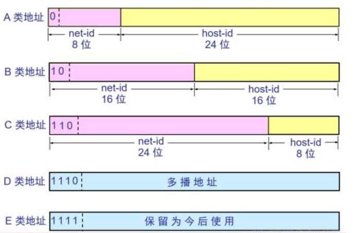
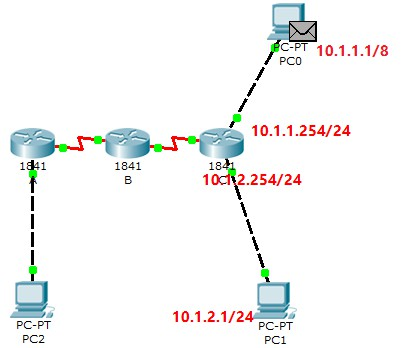
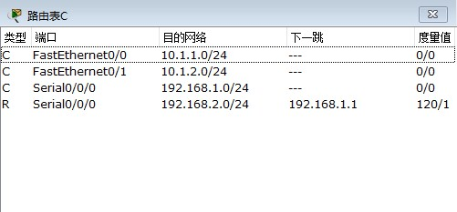

# Internet地址结构

## IP结构

<!--more-->

| 类型 | 可用位数 | 最大二进制表示                      | 十进制表示      | 可用网络号位数 | 可用主机号位数 |
| ---- | -------- | ----------------------------------- | --------------- | -------------- | -------------- |
| A类  | 7        | 01111110                            | 126             | $2^7$ -1       | $2^{24}-2$     |
| B类  | 14       | 10111111.11111111                   | 191.255         | $2^{14}$       | $2^{16}-2$     |
| C类  | 21       | 11011111.11111111.11111111          | 223.255.255     | $2^{21}$       | $2^{8}-2$      |
| D类  | 28       | 11101111.11111111.11111111.11111111 | 239.255.255.255 | $N/A$          | $N/A$          |
| E类  | 28       | 11111111.11111111.11111111.11111110 | 255.255.255.254 | $N/A$          | $N/A$          |

[^注]: 目前Internet上只能看到传统的ABCD类，对于自身站点，接入Internet主机后的网络划分改变了网络部分和主机部分的的限制

## 子网寻址

[^注]: 每个子网主机地址的首和尾都不能使用,分别代表网络号和广播地址

### 增加网络地址

可以在137.168.23.30的主机上增加/26+掩码的地址

*例如：128.32.230.129/26*

也可以在子网段的主机上增加/26+的地址

*例如：128.32.1.x/26 或者 128.32.2.x/26*

**总结：**

网络号可以增加网络地址,划分主机结构

但是并不能增多主机地址的数量

## 广播地址

作用：向子网的所有地址发送数据报

### 本地广播地址

255.255.255.255

[^注]:广播和组播不相同

## IPV6

### EUI64标准(已有新标准RFC 7217)

由64位组成

前24位是OUI（组织位移标识符）+40位扩展标识符

生成方式

例如linux：

Mac地址：00:30:48:2A:19:89

1. 00:30:48:ff:fe:2A:19:89

2. 02:30:48:ff:fe:2A:19:89 u位取反第一个字节的倒数第二位,第一个字节的倒数第一位是g位 

3. 添加默认本地前缀fe80::/10（链路本地单播地址）fe80:0230:48ff:fe2a:1989/64

### TCP的三次握手

1. PC向Server发送请求(该请求有同步标记SYN和随机的SEQ号代表此次请求)
2. Server收到并且返回请求(该请求有响应标记ACK、一个ack number,ack number = seq+1 代表对那个指定的请求作出响应、随机的SEQ号代表此次请求)
3. PC收到请求后返回一个请求(该请求有响应标记ACK、一个ack number,ack number = seq+1,随机的SEQ号代表此次请求)

### TCP的四次挥手

1. PC向Server发送请求(该请求有结束标记FIN、响应标记ACK、随机的SEQ号代表此次请求)
2. Server向PC响应请求(该请求有结束标记FIN、响应标记ACK、随机的SEQ号代表此次请求、seq number = 上一个请求的ack number 代表对那个指定的请求作出响应,ack number= seq+1 )
3. PC向Server发送请求(响应标记ACK、seq number = 上一个请求的ack number, ack number=seq ) 
4. Server停止响应

### 路由的转发访问模拟

1. `PC1`上`PING` `10.1.1.1`
2. `MAC地址`是`PC1`查看自己的ARP表IP对应的MAC地址，没有对应的IP的话那就是请求默认的网关`路由器C`的MAC地址(如果这里的网关是填错了会怎么样呢)
3. `路由器C`接收到了PC1的请求，会查看自己的路由表

4. 可见自己的路由表中有`10.1.1.0/24`，可是目标地址的网段是`10.1.0.0/8`，可是根据**最长匹配原则**还是转发到这台PC，于是将`源MAC地址`封装为自己的MAC地址，从ARP表中的`目标地址`封装成`PC0`的MAC地址，如果没有MAC地址，就对该网段进行广播10.1.255.255进行广播，如果依旧没有则查找下一个路由表中的字段比如`10.1.1.0/16`以此类推，都没有的话则转发到默认的网关，默认网关也没有的话就丢弃包

### 组播与多播

`单播`：生活中绝大的网络连接就是单播，例如HTTP
`广播`：平时作为用户用不到广播，一般是网络硬件的功能，一般`受限广播`只会在当前网段广播，地址为255.255.255.255，例如寻找在当前网段中特定MAC地址的机器，特定IP的机器等等。`直接广播`会被路由到其他网段，地址例如172.16.1.255/24,并会发送到专门网络上的每台主机
`组播`：和广播的功能上的区别是，广播会将消息发送给当前网段所有的机器，而组播是发送给特定的机器。这个用户平时也用不到，一般是硬件的功能，例如网段中的路由器互相交换路由表协议RIP。组播的组播地址一般为224.0.0.0至239.255.255.255，即D类的网络地址
