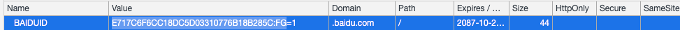

## 浏览器缓存控制

```properties
# 百度下的某个.css 的响应头

# 服务器接受的范围类型
accept-ranges: bytes
age: 59412

# 缓存控制 单位秒 优先级 > expires
cache-control: max-age=2592000
content-encoding: gzip
content-type: text/css
date: Thu, 14 Nov 2019 05:18:01 GMT


# server端标记的当前页面的tag
etag: W/"5dcbce49-67b9"
# 有效时间
expires: Fri, 13 Dec 2019 12:31:16 GMT


# 文件最后修改的时间，配合请求字段If-Modified-Since使用，如果字段If-Modified-Since指定的时间后文件被修改了（last-modified会在服务器更新一个最新的值），会重新请求，否则返回304，浏览器会使用缓存

last-modified: Wed, 13 Nov 2019 09:35:05 GMT

#缺少了Etag
ohc-cache-hit: nb3ct97 [4], nb2ctcache51 [4]
ohc-response-time: 1 0 0 0 0 0
server: JSP3/2.0.14
status: 200
vary: Accept-Encoding
```


**未出现的响应首部**

```properties
#作用与cache-control一样但不限于缓存 兼容HTTP/1.0
Pragma: no-cache
# client请求首部 如果etag中没有包含的标签,那么更新页面
If-None-Match: 
# client请求首部 如果字段If-Modified-Since指定的时间后文件被修改了（last-modified会在服务器更新一个最新的值），会重新请求，否则返回304，浏览器会使用缓存
If-Modified-Since:
```

**no-store与no-cache的区别**

no-store 会禁止缓存

no-cache 依旧会缓存，只是在使用缓存的使用会验证If-Modified-Since:,If-None-Match: 


<!--more-->

## Cookie （4K） 

> 当一个用户通过http访问一个服务器时，这个服务器会将一些Key/Value 键值对返回给客户端浏览器，并且给这些数据加上一些限制条件，在条件符合这个用户下次访问这个服务器时，数据又被完整地带会给服务器





**陌生字段解释**

| 字段名   | 默认值 | 含义                                                         |
| -------- | ------ | ------------------------------------------------------------ |
| HttpOnly |        | 只有通过Http访问才能使用Cookie，(JS脚本、Applet等)将无法读取到Cookie信息 |
| secure   |        | 表示创建的 Cookie 会被以安全的形式向服务器传输，也就是只能在 HTTPS 连接中被浏览器传递到服务器端进行会话验证，如果是 HTTP 连接则不会传递该信息，所以不会被窃取到Cookie 的具体内容。 |

## Session

浏览器第一次访问服务器会在服务器端生成一个session，有一个sessionid和它对应