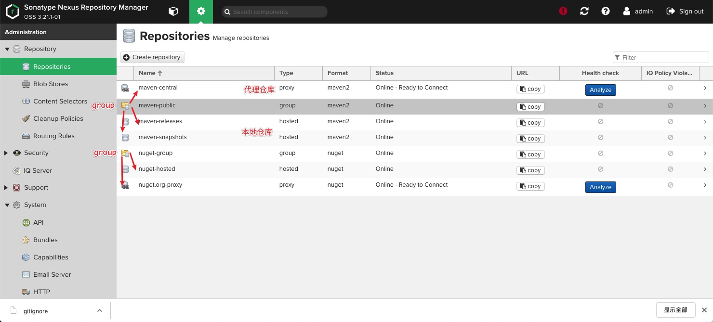
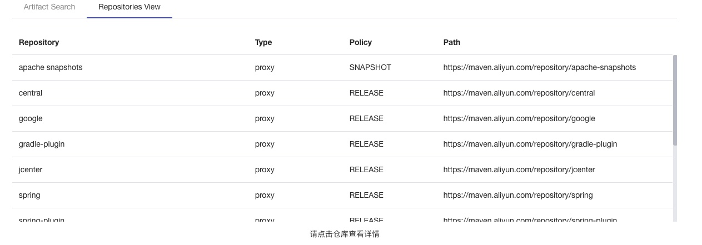
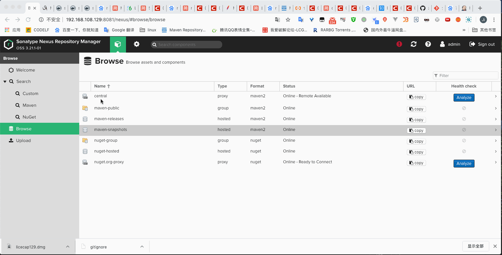

### 安装环境

| 环境 | 名称   |
| :--- | :----- |
| 容器 | docker |


### 步骤

1. `sudo docker run -itd -p 8081:8081 --name nexus -v ~/nexus-data:/nexus-data -e NEXUS_CONTEXT=nexus 7e69`
2. 登陆`http://192.168.108.129:8081/nexus/`，初始密码在`nexus-data/admin.password`中

3. 配置仓库
   1. 仓库说明
      
| 项目   | 具体说明                                   |
| ------ | ------------------------------------------ |
| hosted | 本地存储。像官方仓库一样提供本地私库功能   |
| proxy  | 提供代理其它仓库的类型                     |
| group  | 组类型，能够组合多个仓库为一个地址提供服务 |
   2. 和阿里的仓库对比
      


4. 此时nexus可以正常使用，接下来配置项目代码
<!-- more -->

`pom.xml`
```xml
<!-- 仓库的导入配置 -->
    <profiles>
        <profile>
            <id>localRepository</id>
            <repositories>
                <repository>
                    <!-- 私有仓库 -->
                    <id>private-nexus</id>
                </repository>
            </repositories>
        </profile>
    </profiles>

<!-- 仓库的上传配置 -->
    <distributionManagement>
        <repository>
            <id>maven-releases</id>
            <url>http://192.168.108.129:8081/nexus/repository/maven-releases/</url>
        </repository>
        <snapshotRepository>
            <id>maven-snapshots</id>
            <url>http://192.168.108.129:8081/nexus/repository/maven-snapshots/</url>
        </snapshotRepository>
    </distributionManagement>

```

### 仓库的导入配置

`settings.xml`配置如下
```xml
    <mirror>
    <!-- pom.xml中的id需要靠它定位 -->
      <id>private-nexus</id>
      <!-- 当中的仓库 -->
      <mirrorOf>central,maven-releases,maven-snapshots</mirrorOf>  
      <name>a way to repository </name>
      <!-- 一个group的地址 -->
      <url>http://192.168.108.129:8081/nexus/repository/maven-public/</url>  
    </mirror>
```


### 仓库的上传配置

`settings.xml`配置如下

```xml

    <server>
    <!-- pom.xml中的id需要靠它定位 -->
      <id>maven-releases</id>
        <!-- username password   是你仓库分配的用户名和密码 -->
      <username>admin</username>
      <password>cxz</password>
    </server>


    <server>
    <!-- pom.xml中的id需要靠它定位 -->
      <id>maven-snapshots</id>
      <username>admin</username>
      <password>cxz</password>
    </server>

```




### 另外

之前搭建一个Jenkins，可能会出现容器网络无法互通的情况，可以尝试如下解决
1. `docker network create mynet` 默认为桥接模式
2. `docker network connect mynet [jenkins name]`
3. `docker network connect mynet [nexus name]`

或者在nexus 启动时
`docker run --net=mynet`
