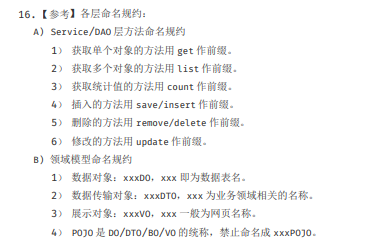
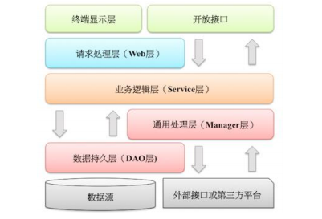

### 编程规约

1. 各层命名规约： 

2. 所有的相同类型的包装类对象之间值的比较，**全部使用 equals 方法比较**

3.  【强制】关于 hashCode 和 equals 的处理，遵循如下规则：

   a.  **只要重写 equals**，就必须重写 hashCode。

   b.  因为 Set 存储的是不重复的对象，依据 hashCode 和 equals 进行判断，所以 **Set 存储的 对象必须重写这两个方法**。

   c.  如果**自定义对象作为 Map 的键，那么必须重写 hashCode 和 equals。** 说明：String 重写了 hashCode 和 equals 方法，所以我们可以非常愉快地使用 String 对象 作为 key 来使用。

4.  【强制】**不要在 foreach 循环里进行元素的 remove/add 操作**。remove 元素请使用 Iterator 方式，如果并发操作，需要对 Iterator 对象加锁。

### 并发

1. 【强制】线程资源必须通过线程池提供，不允许在应用中自行显式创建线程。
2. 高并发时，同步调用应该去考量锁的性能损耗。**能用无锁数据结构**，就不要用锁；**能锁区块**，就不要锁整个方法体；**能用对象锁**，就不要用类锁。
3. 【强制】并发修改同一记录时，避免更新丢失，需要加锁。要么在应用层加锁，要么在缓存加 锁，要么在数据库层使用乐观锁，使用 version 作为更新依据。

### 注释

1. 【强制】类、类属性、类方法的注释必须使用 Javadoc 规范，使用/**内容*/格式，不得使用 // xxx 方式。
2. 【强制】所有的类都必须添加**创建者和创建日期**。
3.  【强制】**方法内部**单行注释，在被注释语句上方另起一行，**使用//注释**。**方法内部多行注释 使用/* */注释**，注意与代码对齐。

### 数据库

1. **不得使用外键与级联**，一切外键概念必须在应用层解决。
2. **禁止使用存储过程**，存储过程难以调试和扩展，更没有移植性。
3. 【强制】表达是与否概念的字段，必须使用 is_xxx 的方式命名，数据类型是 unsigned tinyint （ 1 表示是，0 表示否）。
4.  【强制】表名、字段名必须使用小写字母或数字，禁止出现数字开头，禁止两个下划线中间只 出现数字。
5.  【强制】业务上具有唯一特性的字段，即使是多个字段的组合，也必须建成唯一索引。

6.  【强制】在 varchar 字段上建立索引时，必须指定索引长度，没必要对全字段建立索引，根据 实际文本区分度决定索引长度即可。
7.  【强制】**不要使用 count(列名)或 count(常量)来替代 count(*)，count(*)是 SQL92 定义的 标准统计行数的语法，跟数据库无关，跟 NULL 和非 NULL 无关。**
8.  【强制】**不得使用外键与级联**，一切外键概念必须在应用层解决。
9. 【强制】数据订正（特别是删除、修改记录操作）时，**要先 select，避免出现误删除**，确认 无误才能执行更新语句。

### 异常

1. 【强制】异常不要用来做流程控制，条件控制。
2. 【强制】catch 时请分清稳定代码和非稳定代码，稳定代码指的是无论如何不会出错的代码。 对于非稳定代码的 catch 尽可能进行区分异常类型，再做对应的异常处理。
3. 【强制】**捕获异常是为了处理它**，不要捕获了却什么都不处理而抛弃之，如果不想处理它，请 将该异常抛给它的调用者。最外层的业务使用者，必须处理异常，将其转化为用户可以理解的 内容。
4. 【强制】**表必备三字段：id, gmt_create, gmt_modified**。 说明：其中 id 必为主键，类型为 unsigned bigint、单表时自增、步长为 1。gmt_create, gmt_modified 的类型均为 datetime 类型，前者现在时表示主动创建，后者过去分词表示被 动更新。

### 日志

1. 【强制】应用中**不可直接使用日志系统（Log4j、Logback）中的 API**，而应依赖使用日志框架 SLF4J 中的 API，使用门面模式的日志框架，有利于维护和各个类的日志处理方式统一。
2. 【强制】应用中的扩展日志（如打点、临时监控、访问日志等）命名方式： appName_logType_logName.log。logType:日志类型，推荐分类有 stats/monitor/visit 等； logName:日志描述。这种命名的好处：通过文件名就可知道日志文件属于什么应用，什么类 型，什么目的，也有利于归类查找。 正例：mppserver 应用中单独监控时区转换异常，如： mppserver_monitor_timeZoneConvert.log
 说明：推荐对日志进行分类，如将错误日志和业务日志分开存放，便于开发人员查看，也便于 通过日志对系统进行及时监控。如： mppserver_monitor_timeZoneConvert.log

3. 【强制】**对 trace/debug/info 级别的日志输出，必须使用条件输出形式或者使用占位符的方式**。 说明：logger.debug("Processing trade with id: " + id + " and symbol: " + symbol); 如果日志级别是 warn，上述日志不会打印，但是会执行字符串拼接操作，如果 symbol 是对象， 会执行 toString()方法，浪费了系统资源，执行了上述操作，最终日志却没有打印。 正例：（条件） if (logger.isDebugEnabled()) { logger.debug("Processing trade with id: " + id + " and symbol: " + symbol); } 正例：（占位符） logger.debug("Processing trade with id: {} and symbol : {} ", id, symbol); 

### 其他

1. 【强制】在使用正则表达式时，利用好其预编译功能，可以有效加快正则匹配速度。

2. 【强制】获取当前毫秒数 System.currentTimeMillis(); 而不是 new Date().getTime();

### 单元测试

1. 【强制】单元测试中不准使用 System.out 来进行人肉验证，必须使用 assert 来验证
2. 

### 工程

1. 【参考】分层领域模型规约： 
     a. **DO（Data Object）：与数据库表结构一一对应，通过 DAO 层向上传输数据源对象。** 
     b. **DTO（Data Transfer Object）：数据传输对象，Service 或 Manager 向外传输的对象。**
     c. BO（Business Object）：业务对象。由 Service 层输出的封装业务逻辑的对象。 
     d. AO（Application Object）：应用对象。在 Web 层与 Service 层之间抽象的复用对象模型， 极为贴近展示层，复用度不高。 
     e. **VO（View Object）：显示层对象，通常是 Web 向模板渲染引擎层传输的对象。** 
     f. **Query：数据查询对象，各层接收上层的查询请求。注意超过 2 个参数的查询封装，禁止 使用 Map 类来传输**

2. 【强制】定义 GAV 遵从以下规则： 1） GroupID 格式：com.{公司/BU }.业务线.[子业务线]，最多 4 级。

   ​	ArtifactID 格式：产品线名-模块名。语义不重复不遗漏，先到中央仓库去查证一下。 正例：dubbo-client / fastjson-api / jstorm-tool